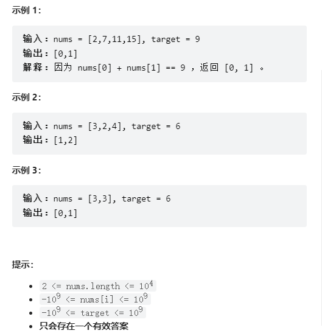
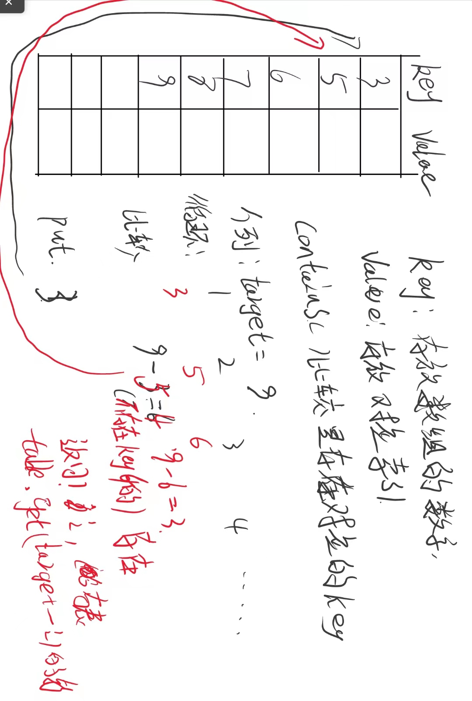

# 两数之和

## 问题

给定一个整数数组 nums 和一个整数目标值 target，请你在该数组中找出 和为目标值 target  的那 两个 整数，并返回它们的数组下标。

你可以假设每种输入只会对应一个答案。但是，数组中同一个元素在答案里不能重复出现。

你可以按任意顺序返回答案。

## 答案

此时可以使用哈希表来解决

~~~java
    public int[] twoSum(int[] nums, int target) {
        // 创建一个哈希表来存储：数字-以及数字相对应的索引
        HashMap<Integer, Integer> table = new HashMap<>();
        // 遍历数组
        for (int i = 0; i < nums.length; i++) {
            // containsKey()判断是否存在这样key
            if (table.containsKey(target - nums[i])) {
                // 存在返回
                return new int[]{table.get(target-nums[i]), i};
            }
            // 加入新的数
            table.put(nums[i], i);
        }
        return nums;
    }
~~~

