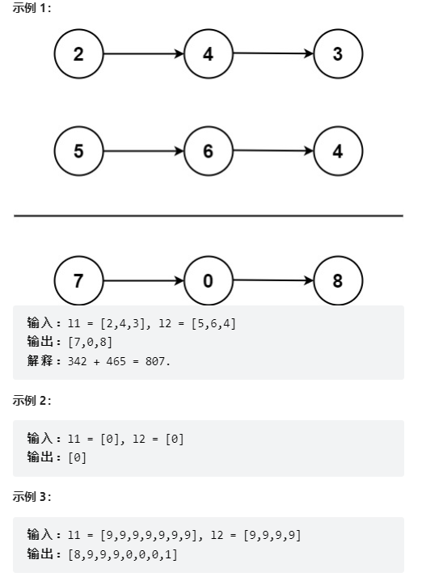
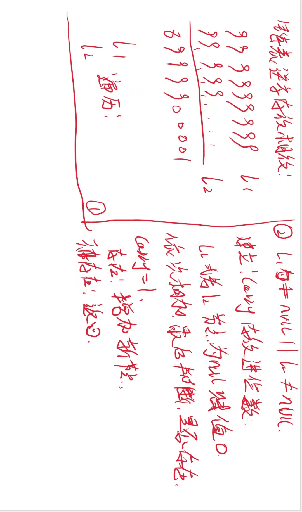

# 链表逆序相加

## 问题：

给你两个 非空 的链表，表示两个非负的整数。它们每位数字都是按照 逆序 的方式存储的，并且每个节点只能存储 一位 数字。

请你将两个数相加，并以相同形式返回一个表示和的链表。

你可以假设除了数字 0 之外，这两个数都不会以 0 开头。

## 解决

~~~java
class Solution {
    public ListNode addTwoNumbers(ListNode l1, ListNode l2) {
        // 创建新的节点
        ListNode listNode = new ListNode(0);
        ListNode temp = listNode;

        // 定义一个进位数
        int carry = 0;

        // 遍历循环相加
        while (l1 != null || l2 != null) {

            int x = l1 == null ? 0 : l1.val;
            int y = l2 == null ? 0 : l2.val;

            int sum = x + y + carry;
            carry = sum / 10;

            // 判断是否有进位数
            temp.next = new ListNode(sum % 10);

            // 后移
            temp = temp.next;
            if (l1 != null) l1 = l1.next;
            if (l2 != null) l2 = l2.next;
        }

        // 判断进位数
        if (carry == 1) temp.next = new ListNode(1);

        return listNode.next;
    }
}

~~~

