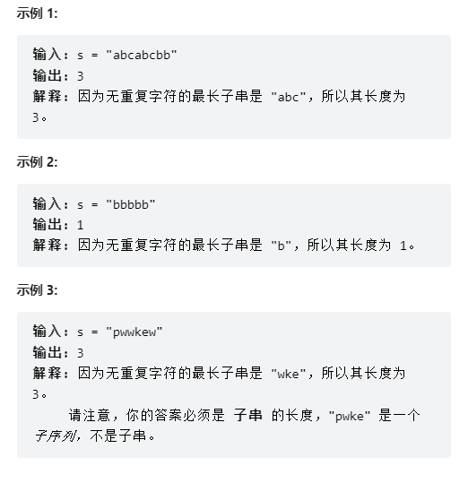
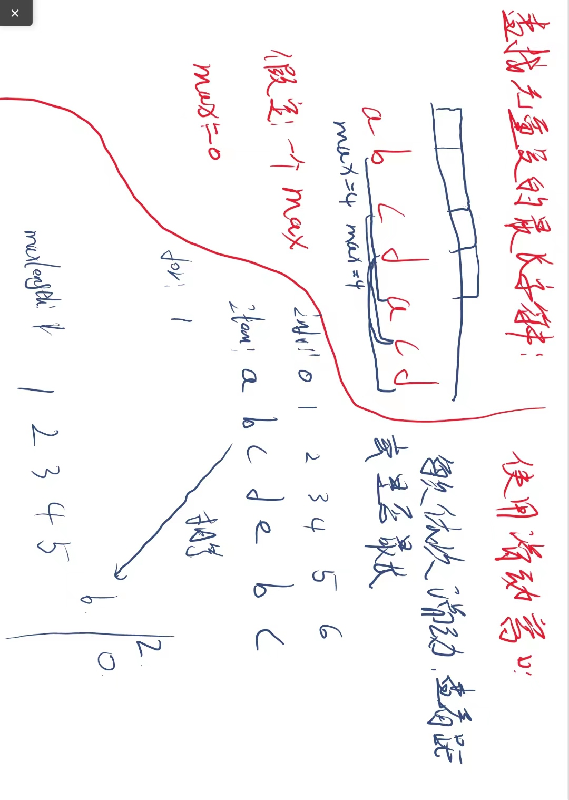

# 3. 无重复字符的最长子串

## 问题

给定一个字符串 `s` ，请你找出其中不含有重复字符的 **最长子串** 的长度。

## 答案

~~~java
class Solution {
    /**
     * 查找无重复字符串的长度
     *
     * @param s 查找字符串
     * @return 长度
     */
    public int lengthOfLongestSubstring(String s) {
        // 判断
        if (s.length() < 1) return 0;

        int length = s.length();
        // 使用滑动窗口
        HashMap<Character, Integer> map = new HashMap<>();
        // 定义左右指针-字符串长度
        int maxLength = 0;
        for (int start = 0, end = 0; end < length; end++) {
            char charAt = s.charAt(end);

            // 是否存在该字符
            if (map.containsKey(charAt)) {
                start = Math.max(map.get(charAt), start);
            }
            // 最长长度比较-存储的最长值和新比较的
            maxLength = Math.max(maxLength, end - start + 1);
            map.put(charAt, end + 1);
        }
        return maxLength;
    }
}

~~~

