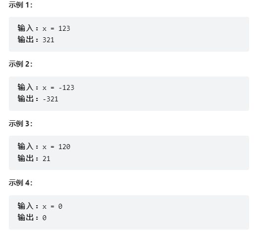
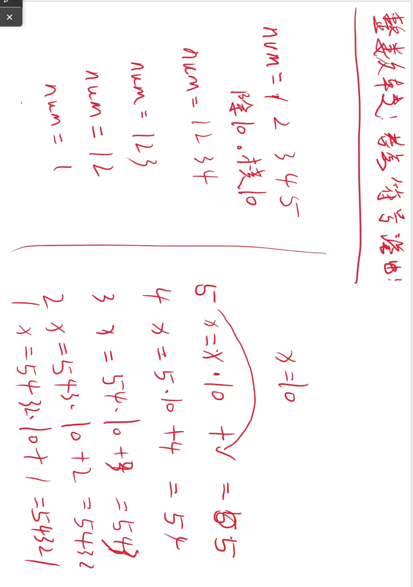

# 7. 整数反转

## 问题

给你一个 32 位的有符号整数 x ，返回将 x 中的数字部分反转后的结果。

如果反转后整数超过 32 位的有符号整数的范围 [−231,  231 − 1] ，就返回 0。

假设环境不允许存储 64 位整数（有符号或无符号）。

## 答案

~~~java
    /**
     * 整数反转
     *
     * @param x 整数
     * @return 反转之后的数
     */
    public int reverse(int x) {
        int revnum = 0;

        while (x != 0) {
            // 求模
            int pop = x % 10;

            // 判断溢出
            if (revnum > Integer.MAX_VALUE / 10 || (revnum == Integer.MAX_VALUE / 10 && pop > 7))
                return 0;
            if (revnum < Integer.MIN_VALUE / 10 || (revnum == Integer.MIN_VALUE / 10 && pop < -8))
                return 0;

            // 反转之后的值
            revnum = revnum * 10 + pop;
            x /= 10;

        }
        return revnum;
    }
~~~

