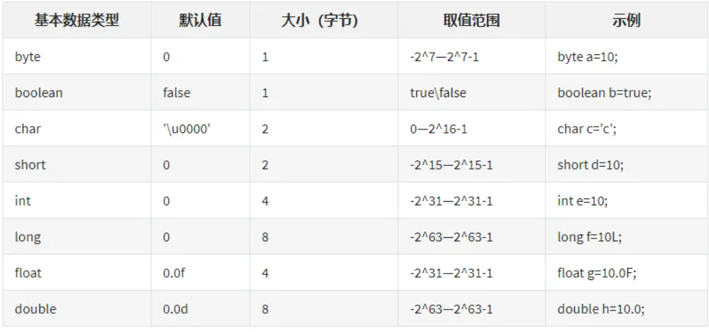
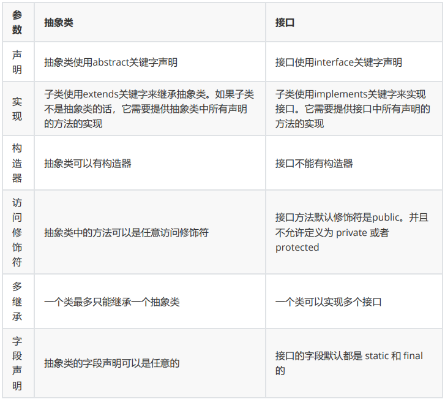

# JavaSE

## Java概述

### 何为编程 

编程就是让计算机为解决某个问题而使用某种程序设计语言编写程序代码，并 终得到结果的过程。 为了使计算机能够理解人的意图，人类就必须要将需解决的问题的思路、方法、 和手段通过计算机能够 理解的形式告诉计算机，使得计算机能够根据人的指令一 步一步去工作，完成某种特定的任务。这种人 和计算机之间交流的过程就是编程。 

### 什么是Java 

Java是一门面向对象编程语言，不仅吸收了C++语言的各种优点，还摒弃了 C++里难以理解的多继承、 指针等概念，因此Java语言具有功能强大和简单易 用两个特征。Java语言作为静态面向对象编程语言的 代表，极好地实现了面向对 象理论，允许程序员以优雅的思维方式进行复杂的编程 。

### jdk1.5之后的三大版本 

- Java SE（J2SE，Java 2 Platform Standard Edition，标准版） Java SE 以前称为 J2SE。它允许开发 和部署在桌面、服务器、嵌入式环境和实时环境中使 用的 Java 应用程序。Java SE 包含了支持 Java Web 服务开发的类，并为Java EE和Java ME提供基础。 
- Java EE（J2EE，Java 2 Platform Enterprise Edition，企业版） Java EE 以前称为 J2EE。企业版本 帮助开发和部署可移植、健壮、可伸缩且安全的服务器 端Java 应用程序。Java EE 是在 Java SE 的 基础上构建的，它提供 Web 服务、组件模型、 管理和通信 API，可以用来实现企业级的面向服务 体系结构（service-oriented architecture，SOA）和 Web2.0应用程序。2018年2月，Eclipse 宣 布正式将 JavaEE 更名 为 JakartaEE 
- Java ME（J2ME，Java 2 Platform Micro Edition，微型版） Java ME 以前称为 J2ME。Java ME 为 在移动设备和嵌入式设备（比如手机、PDA、电视 机顶盒和打印机）上运行的应用程序提供一个健 壮且灵活的环境。Java ME 包括灵活的用 户界面、健壮的安全模型、许多内置的网络协议以及对可 以动态下载的连网和离线应用程序 的丰富支持。基于 Java ME 规范的应用程序只需编写一次，就 可以用于许多设备，而且可 以利用每个设备的本机功能。

### JVM、JRE和JDK的关系

#### JVM 

Java Virtual Machine是Java虚拟机，Java程序需要运行在虚拟机上，不同的平 台有自己的虚拟机，因此 Java语言可以实现跨平台。 

#### JRE 

Java Runtime Environment包括Java虚拟机和Java程序所需的核心类库等。核 心类库主要是java.lang 包：包含了运行Java程序必不可少的系统类，如基本数 据类型、基本数学函数、字符串处理、线程、异 常处理类等，系统缺省加载这个包 如果想要运行一个开发好的Java程序，计算机中只需要安装JRE即可。 

#### JDK 

Java Development Kit是提供给Java开发人员使用的，其中包含了Java的开发 工具，也包括了JRE。所以 安装了JDK，就无需再单独安装JRE了。其中的开发工 具：编译工具(javac.exe)，打包工具(jar.exe)等

### 什么是跨平台性？

​		原理是什么 所谓跨平台性，是指java语言编写的程序，一次编译后，可以在多个系统平台上 运行。 实现原理：Java程序是通过java虚拟机在系统平台上运行的，只要该系统可以安 装相应的java虚拟机， 该系统就可以运行java程序。

### Java语言有哪些特点

- 简单易学（Java语言的语法与C语言和C++语言很接近） 
- 面向对象（封装，继承，多态） 
- 平台无关性（Java虚拟机实现平台无关性） 
- 支持网络编程并且很方便（Java语言诞生本身就是为简化网络编程设计的） 
- 支持多线程（多线程机制使应用程序在同一时间并行执行多项任） 
- 健壮性（Java语言的强类型机制、异常处理、垃圾的自动收集等） 
- 安全性

### 什么是字节码？采用字节码的大好处是什么

**字节码**：Java源代码经过虚拟机编译器编译后产生的文件（即扩展为.class的文 件），它不面向任何特 定的处理器，只面向虚拟机（JVM）。 

**采用字节码的好处**： Java语言通过字节码的方式，在一定程度上解决了传统解释型语言执行效率低的 问题，同时又保留了解 释型语言可移植的特点。所以Java程序运行时比较高效， 而且，由于字节码并不专对一种特定的机器， 因此，Java程序无须重新编译便可 在多种不同的计算机上运行。 

**先看下java中的编译器和解释器：** Java中引入了虚拟机的概念，即在机器和编译程序之间加入了一层抽象的虚拟机 器。这台虚拟的机器在 任何平台上都提供给编译程序一个的共同的接口。编译程 序只需要面向虚拟机，生成虚拟机能够理解的 代码，然后由解释器来将虚拟机代 码转换为特定系统的机器码执行。在Java中，这种供虚拟机理解的代 码叫做字节 码（即扩展为.class的文件），它不面向任何特定的处理器，只面向虚拟机。每 一种平台的解释器是不同的，但是实现的虚拟机是相同的。Java源程序经过编译 器编译后变成字节码，字节码由虚 拟机解释执行，虚拟机将每一条要执行的字节 码送给解释器，解释器将其翻译成特定机器上的机器码， 然后在特定的机器上运 行，这就是上面提到的Java的特点的编译与解释并存的解释。

~~~ABAP
Java源代码---->编译器---->jvm可执行的Java字节码(即虚拟指令)---->jvm---->jvm中 解释器----->
机器可执行的二进制机器码---->程序运行。
~~~

### 什么是Java程序的主类？

​		应用程序和小程序的主类有何不同？ 一个程序中可以有多个类，但只能有一个类是主类。在Java应用程序中，这个主 类是指包含main()方法 的类。而在Java小程序中，这个主类是一个继承自系统 类JApplet或Applet的子类。应用程序的主类不一 定要求是public类，但小程序 的主类要求必须是public类。主类是Java程序执行的入口点。

### Java应用程序与小程序之间有那些差别？ 

​		简单说应用程序是从主线程启动(也就是main()方法)。applet小程序没有main 方法，主要是嵌在浏览器 页面上运行(调用init()线程或者run()来启动)，嵌入浏 览器这点跟flash的小游戏类似。

### Java和C++的区别

- 都是面向对象的语言，都支持封装、继承和多态 
- Java不提供指针来直接访问内存，程序内存更加安全 
- Java的类是单继承的，C++支持多重继承；虽然Java的类不可以多继承，但是 接口可以多继承。
-  Java有自动内存管理机制，不需要程序员手动释放无用内存

### Oracle JDK 和 OpenJDK 的对比

1. Oracle JDK版本将每三年发布一次，而OpenJDK版本每三个月发布一 次； 
2. OpenJDK 是一个参考模型并且是完全开源的，而Oracle JDK是 OpenJDK的一个实现，并不是完全 开源的； 
3. Oracle JDK 比 OpenJDK 更稳定。OpenJDK和Oracle JDK的代码几乎 相同，但Oracle JDK有更多的 类和一些错误修复。因此，如果您想开发企 业/商业软件，我建议您选择Oracle JDK，因为它经过 了彻底的测试和稳 定。某些情况下，有些人提到在使用OpenJDK 可能会遇到了许多应用程 序崩溃 的问题，但是，只需切换到Oracle JDK就可以解决问题； 
4. 在响应性和JVM性能方面，Oracle JDK与OpenJDK相比提供了更好的 性能； 
5. Oracle JDK不会为即将发布的版本提供长期支持，用户每次都必须通过 更新到最新版本获得支持来 获取最新版本； 
6. Oracle JDK根据二进制代码许可协议获得许可，而OpenJDK根据GPL v2许可获得许可。

## 基础语法

### 数据类型

#### Java基本数据类型图

- 数值型 
  - 整数类型(byte,short,int,long) 
  - 浮点类型(float,double) 
- 字符型(char) 
- 布尔型(boolean)

#### 引用类型

1. 类(class) 
2. 接口(interface) 
3. 数组([])

#### switch 

Switch是否能作用在 byte 上，是否能作用在 long 上，是否 能作用在 String 上

​		在 Java 5 以前，switch(expr)中，expr 只能是 byte、short、char、int。从 Java5 开始，Java 中引入 了枚举类型，expr 也可以是 enum 类型，从 Java 7 开始，expr 还可以是字符串（String），但是长整 型（long）在目前所有的版 本中都是不可以的	

#### 用最有效率的方法计算 2 乘以 8 

2 << 3（左移 3 位相当于乘以 2 的 3 次方，右移 3 位相当于除以 2 的 3 次 方）。

#### Math.round(11.5) 等于多少？Math.round(-11.5) 等于多少 

Math.round(11.5)的返回值是 12，Math.round(-11.5)的返回值是-11。四舍 五入的原理是在参数上加 0.5 然后进行下取整。

#### float f=3.4;是否正确 

​		不正确。3.4 是双精度数，将双精度型（double）赋值给浮点型（float）属于 下转型（down-casting， 也称为窄化）会造成精度损失，因此需要强制类型转 换float f =(float)3.4; 或者写成 float f =3.4F;。

#### short s1 = 1; s1 = s1 + 1;有错吗?short s1 = 1; s1 += 1;有错吗 

​	对于 short s1 = 1; s1 = s1 + 1;由于 1 是 int 类型，因此 s1+1 运算结果也是 int型，需要强制转换类型才 能赋值给 short 型。 而 short s1 = 1; s1 += 1;可以正确编译，因为 s1+= 1;相当于 s1 = (short(s1 + 1);其 中有隐含的强制类型转换。

### 编码

#### Java语言采用何种编码方案？有何特点？ 

​		Java语言采用Unicode编码标准，Unicode（标准码），它为每个字符制订了一 个唯一的数值，因此在 任何的语言平台，程序都可以放心的使用。

### 注释

1. 单行注释 格式： // 注释文字 
2. 多行注释 格式： /* 注释文字 */ 
3. 文档注释 格式：/** 注释文字 */

​		在程序中，尤其是复杂的程序中，适当地加入注释可以增加程序的可读性，有利 于程序的修改、调试和 交流。注释的内容在程序编译的时候会被忽视，不会产生 目标代码，注释的部分不会对程序的执行结果 产生任何影响。 注意事项：多行和文档注释都不能嵌套使用。 访问修饰符

### 修饰符

#### 访问修饰符 public,private,protected,以及不写（默认）时的 区别

**定义**：Java中，可以使用访问修饰符来保护对类、变量、方法和构造方法的访 问。Java 支持 4 种不同的 访问权限。

**分类**： 

- private : 在同一类内可见。使用对象：变量、方法。 注意：不能修饰类（外部 类） 
- default (即缺省，什么也不写，不使用任何关键字）: 在同一包内可见，不使用 任何修饰符。使用 对象：类、接口、变量、方法。 
- protected : 对同一包内的类和所有子类可见。使用对象：变量、方法。 注意： 不能修饰类（外部 类）。
- public : 对所有类可见。使用对象：类、接口、变量、方法

| 修饰符    | 当前类 | 同包 | 子类 | 其他包 |
| --------- | ------ | ---- | ---- | ------ |
| private   | 可     |      |      |        |
| default   | 可     | 可   |      |        |
| protected | 可     | 可   | 可   |        |
| public    | 可     | 可   | 可   | 可     |

### 运算符

#### &和&&的区别

&运算符有两种用法：(1)按位与；(2)逻辑与。 

​		&&运算符是短路与运算。逻辑与跟短路与的差别是非常巨大的，虽然二者都要 求运算符左右两端的布 尔值都是true 整个表达式的值才是 true。&&之所以称 为短路运算，是因为如果&&左边的表达式的值是 false，右边的表达式会被直 接短路掉，不会进行运 算。

注意：逻辑或运算符（|）和短路或运算符（||）的差别也是如此。

### 关键字

#### Java 有没有 goto 

goto 是 Java 中的保留字，在目前版本的 Java 中没有使用。

#### final 有什么用？

- 用于修饰类、属性和方法； 
- 被final修饰的类不可以被继承 
- 被final修饰的方法不可以被重写 
- 被final修饰的变量不可以被改变，被final修饰不可变的是变量的引用，而不是引用指向的内容，引 用指向的内容是可以改变的

#### final finally finalize区别

- final可以修饰类、变量、方法，修饰类表示该类不能被继承、修饰方法表示该方法不能被重写、修 饰变量表示该变量是一个常量不能被重新赋值。 
- finally一般作用在try-catch代码块中，在处理异常的时候，通常我们将一定要执行的代码方法 finally代码块中，表示不管是否出现异常，该代码块都会执行，一般用来存放一些关闭资源的代 码。 
- finalize是一个方法，属于Object类的一个方法，而Object类是所有类的父类，该方法一般由垃圾 回收器来调用，当我们调用System.gc() 方法的时候，由垃圾回收器调用finalize()，回收垃圾，一 个对象是否可回收的最后判断。

#### this关键字的用法

this是自身的一个对象，代表对象本身，可以理解为：指向对象本身的一个指 针。 

this的用法在java中大体可以分为3种： 

1.普通的直接引用，this相当于是指向当前对象本身。 

2.形参与成员名字重名，用this来区分：

~~~java
public Person(String name, int age) {
	this.name = name;
 	this.age = age;
}
~~~

3.引用本类的构造函数

~~~java
class Person{
	 private String name;
	 private int age;
    
	public Person() {
	}
    
	public Person(String name) {
		this.name = name;
	}
    
	 public Person(String name, int age) {
		 this(name);
		this.age = age;
	}
}
~~~

#### super关键字的用法

super可以理解为是指向自己超（父）类对象的一个指针，而这个超类指的是离 自己最近的一个父类。 

super也有三种用法： 

1.普通的直接引用 与this类似，super相当于是指向当前对象的父类的引用，这样就可以用 super.xxx来引用父类的成员。 

2.子类中的成员变量或方法与父类中的成员变量或方法同名时，用super进行区 分

3.引用父类构造函数

​	super（参数）：调用父类中的某一个构造函数（应该为构造函数中的第一条语句）。 

​	this（参数）：调用本类中另一种形式的构造函数（应该为构造函数中的第一条语句）。

#### this与super的区别

- super: 它引用当前对象的直接父类中的成员（用来访问直接父类中被隐藏的父类中成员数据或函 数，基类与派生类中有相同成员定义时如：super.变量名 super.成员函数据名（实参） 
- this：它代表当前对象名（在程序中易产生二义性之处，应使用this来指明当前对象；如果函数的 形参与类中的成员数据同名，这时需用this来指明成员变量名） 
- super()和this()类似,区别是，super()在子类中调用父类的构造方法，this()在本类内调用本类的其 它构造方法。 
- super()和this()均需放在构造方法内第一行。 尽管可以用this调用一个构造器，但却不能调用两个。 this和super不能同时出现在一个构造函数里面，因为this必然会调用其它的构造函数，其它的构造 函数必然也会有super语句的存在，所以在同一个构造函数里面有相同的语句，就失去了语句的意 义，编译器也不会通过。 
- this()和super()都指的是对象，所以，均不可以在static环境中使用。包括： static变量,static方法，static语句块。 
- 从本质上讲，this是一个指向本对象的指针, 然而super是一个Java关键字。

#### static存在的主要意义

​		static的主要意义是在于创建独立于具体对象的域变量或者方法。以致于即使没有创建对象，也能使用属 性和调用方法！ 

​		static关键字还有一个比较关键的作用就是 用来形成静态代码块以优化程序性能。static块可以置于类中 的任何地方，类中可以有多个static块。在类初次被加载的时候，会按照static块的顺序来执行每个static 块，并且只会执行一次。

​		为什么说static块可以用来优化程序性能，是因为它的特性:只会在类加载的时 候 执行一次。因此，很多时候会将一些只需要进行一次的初始化操作都放在static代码块中进行。

#### static的独特之处

1、被static修饰的变量或者方法是独立于该类的任何对象，也就是说，这些变量和方法不属于任何一个 实例对象，而是被类的实例对象所共享。

​	怎么理解 “被类的实例对象所共享” 这句话呢？就是说，一个类的静态成员，它是属于大伙的【大 伙指的是这个类的多个对象实例，我们都知道一个类可以创建多个实例！】，所有的类对象共享 的，不像成员变量是自个的【自个指的是这个类的单个实例对象】…我觉得我已经讲的很通俗了， 你明白了咩？

2、在该类被第一次加载的时候，就会去加载被static修饰的部分，而且只在类第一次使用时加载并进行 初始化，注意这是第一次用就要初始化，后面根据需要是可以再次赋值的。 

3、static变量值在类加载的时候分配空间，以后创建类对象的时候不会重新分配。赋值的话，是可以任 意赋值的！ 

4、被static修饰的变量或者方法是优先于对象存在的，也就是说当一个类加载完毕之后，即便没有创建 对象，也可以去访问。

#### static应用场景

​		因为static是被类的实例对象所共享，因此如果某个成员变量是被所有对象所共享的，那么这个成员变量 就应该定义为静态变量。 

因此比较常见的static应用场景有：

1、修饰成员变量 

2、修饰成员方法 

3、静态代码块 

4、修饰类【只能修饰内部类也就是静态内部类】 

5、静态导包

#### static注意事项 

1、静态只能访问静态。 

2、非静态既可以访问非静态的，也可以访问静态的。

### 流程控制语句

#### break ,continue ,return 的区别及作用 

​		break 跳出总上一层循环，不再执行循环(结束当前的循环体)continue 跳出本次循环，继续执行下次循环(结束正在执行的循环 进入下一个循环条件) return 程序返回，不再执行下面的代码(结束当前的方法 直接返回)

#### 在 Java 中，如何跳出当前的多重嵌套循环 

​		在Java中，要想跳出多重循环，可以在外面的循环语句前定义一个标号，然后在里层循环体的代码中使 用带有标号的break 语句，即可跳出外层循环。

## 面向对象 

### 面向对象概述

#### 面向过程： 

优点：性能比面向对象高，因为类调用时需要实例化，开销比较大，比较消耗资源;比如单片机、嵌入式 开发、Linux/Unix等一般采用面向过程开发，性能是最重要的因素。

 缺点：没有面向对象易维护、易复用、易扩展 

#### 面向对象： 

优点：易维护、易复用、易扩展，由于面向对象有封装、继承、多态性的特性，可以设计出低耦合的系 统，使系统更加灵活、更加易于维护 

缺点：性能比面向过程低 面向过程是具体化的，流程化的，解决一个问题，你需要一步一步的分析，一步 一步的实现。

面向对象是模型化的，你只需抽象出一个类，这是一个封闭的盒子，在这里你拥有数据也拥有解决问题 的方法。需要什么功能直接使用就可以了，不必去一步一步的实现，至于这个功能是如何实现的，管我 们什么事？我们会用就可以了。 面向对象的底层其实还是面向过程，把面向过程抽象成类，然后封装，方便我们使用的就是面向对象 了。

### 面向对象三大特性

**封装** : 封装把一个对象的属性私有化，同时提供一些可以被外界访问的属性的方法，如 果属性不想 被外界访问，我们大可不必提供方法给外界访问。但是如果一个类没 有提供给外界访问的方法，那 么这个类也没有什么意义了。 

**继承** : 继承是使用已存在的类的定义作为基础建立新类的技术，新类的定义可以增加新 的数据或新 的功能，也可以用父类的功能，但不能选择性地继承父类。通过使用 继承我们能够非常方便地复用 以前的代码。 关于继承如下 3 点请记住： 

1.子类拥有父类非 private 的属性和方法。 

2.子类可以拥有自己属性和方法，即子类可以对父类进行扩展。 

3.子类可以用自己的方式实现父类的方法。 

**多态** : 所谓多态就是指程序中定义的引用变量所指向的具体类型和通过该引用变量发出 的方法调用 在编程时并不确定，而是在程序运行期间才确定，即一个引用变量到 底会指向哪个类的实例对象， 该引用变量发出的方法调用到底是哪个类中实现的 方法，必须在由程序运行期间才能决定。 在Java中有两种形式可以实现多态：继承（多个子类对同一方法的重写）和接口 （实现接口并覆盖 接口中同一方法）。

#### 其中Java 面向对象编程三大特性：封装 继承 多态

封装：隐藏对象的属性和实现细节，仅对外提供公共访问方式，将变化隔离，便 于使用，提高复用性和 安全性。

继承：继承是使用已存在的类的定义作为基础建立新类的技术，新类的定义可以 增加新的数据或新的功 能，也可以用父类的功能，但不能选择性地继承父类。通 过使用继承可以提高代码复用性。继承是多态 的前提。

多态性：父类或接口定义的引用变量可以指向子类或具体实现类的实例对象。提 高了程序的拓展性。 在Java中有两种形式可以实现多态：继承（多个子类对同一方法的重写）和接口 （实现接口并覆盖接口 中同一方法）。 方法重载（overload）实现的是编译时的多态性（也称为前绑定），而方法重 写（override）实现的是 运行时的多态性（也称为后绑定）。

一个引用变量到底会指向哪个类的实例对象，该引用变量发出的方法调用到底是 哪个类中实现的方法， 必须在由程序运行期间才能决定。运行时的多态是面向对 象精髓的东西，要实现多态需要做两件事： 方法重写（子类继承父类并重写父类中已有的或抽象的方法）； 对象造型（用父类型引用子类型对象，这样同样的引用调用同样的方法就会根据 子类对象的不同而 表现出不同的行为）。

### 什么是多态机制？Java语言是如何实现多态的？

​		所谓多态就是指程序中定义的引用变量所指向的具体类型和通过该引用变量发出 的方法调用在编程时并 不确定，而是在程序运行期间才确定，即一个引用变量倒 底会指向哪个类的实例对象，该引用变量发出 的方法调用到底是哪个类中实现的 方法，必须在由程序运行期间才能决定。因为在程序运行时才确定具 体的类，这 样，不用修改源程序代码，就可以让引用变量绑定到各种不同的类实现上，从而 导致该引用 调用的具体方法随之改变，即不修改程序代码就可以改变程序运行时 所绑定的具体代码，让程序可以选 择多个运行状态，这就是多态性。 多态分为编译时多态和运行时多态。其中编辑时多态是静态的，主要 是指方法的 重载，它是根据参数列表的不同来区分不同的函数，通过编辑之后会变成两个不 同的函数， 在运行时谈不上多态。而运行时多态是动态的，它是通过动态绑定来 实现的，也就是我们所说的多态性

### 多态的实现

Java实现多态有三个必要条件：继承、重写、向上转型。 

继承：在多态中必须存在有继承关系的子类和父类。 

重写：子类对父类中某些方法进行重新定义，在调用这些方法时就会调用子类的 方法。 

向上转型：在多态中需要将子类的引用赋给父类对象，只有这样该引用才能够具 备技能调用父类的方法 和子类的方法。 

只有满足了上述三个条件，我们才能够在同一个继承结构中使用统一的逻辑实现 代码处理不同的对象， 从而达到执行不同的行为。 

对于Java而言，它多态的实现机制遵循一个原则：当超类对象引用变量引用子类 对象时，被引用对象的 类型而不是引用变量的类型决定了调用谁的成员方法，但 是这个被调用的方法必须是在超类中定义过 的，也就是说被子类覆盖的方法。

### 面向对象五大基本原则是什么（可选）

- 单一职责原则SRP(Single Responsibility Principle)类的功能要单一，不能包罗万象，跟杂货铺似 的。 
- 开放封闭原则OCP(Open－Close Principle) 一个模块对于拓展是开放的，对于修改是封闭的，想要增加功能热烈欢迎，想要修改，哼， 一万个不乐意。 
- 里式替换原则LSP(the Liskov Substitution Principle LSP)子类可以替换父类出现在父类能够出现的 任何地方。比如你能代表你爸去你姥姥家干活。哈哈~~ 
- 依赖倒置原则DIP(the Dependency Inversion Principle DIP)高层次的模块不应该依赖于低层次的 模块，他们都应该依赖于抽象。抽象不应该依赖于具体实现，具体实现应该依赖于抽象。就是你出 国要说你是中国人，而不能说你是哪个村子的。比如说中国人是抽象的，下面有具体的xx省，xx 市，xx县。你要依赖的抽象是中国人，而不是你是xx村的。 
- 接口分离原则ISP(the Interface Segregation Principle ISP) 设计时采用多个与特定客户类有关的接口比采用一个通用的接口要好。就比如一个手机拥有 打电话，看视频，玩游戏等功能，把这几个功能拆分成不同的接口，比在一个接口里要好的 多。

## 类与接口

### 抽象类和接口的对比 

​		抽象类是用来捕捉子类的通用特性的。接口是抽象方法的集合。 从设计层面来说，抽象类是对类的抽象，是一种模板设计，接口是行为的抽象，是一种行为的规范。

#### 相同点 

1. 接口和抽象类都不能实例化 
2. 都位于继承的顶端，用于被其他实现或继承 
3. 都包含抽象方法，其子类都必须覆写这些抽象方法

#### 不同点

**备注**：Java8中接口中引入默认方法和静态方法，以此来减少抽象类和接口之间 的差异。 

现在，我们可以为接口提供默认实现的方法了，并且不用强制子类来实现它。 接口和抽象类各有优缺 点，在接口和抽象类的选择上，必须遵守这样一个原则： 

- 行为模型应该总是通过接口而不是抽象类定义，所以通常是优先选用接口，尽量 少用抽象类。 
- 选择抽象类的时候通常是如下情况：需要定义子类的行为，又要为子类提供通用 的功能。

### 普通类和抽象类有哪些区别？

- 普通类不能包含抽象方法，抽象类可以包含抽象方法。 

- 抽象类不能直接实例化，普通类可以直接实例化。

### 抽象类能使用 final 修饰吗？

​		不能，定义抽象类就是让其他类继承的，如果定义为 final 该类就不能被继承， 这样彼此就会产生矛 盾，所以 final 不能修饰抽象类

### 创建一个对象用什么关键字？对象实例与对象引用有何不同？ 

​		new关键字，new创建对象实例（对象实例在堆内存中），对象引用指向对象实 例（对象引用存放在栈 内存中）。一个对象引用可以指向0个或1个对象（一根 绳子可以不系气球，也可以系一个气球）;一个 对象可以有n个引用指向它（可以 用n条绳子系住一个气球）

## 变量与方法

### 成员变量与局部变量的区别有哪些

​		变量：在程序执行的过程中，在某个范围内其值可以发生改变的量。从本质上 讲，变量其实是内存中的 一小块区域 成员变量：方法外部，类内部定义的变量 局部变量：类的方法中的变量。 成员变量和局部 变量的区别

#### 作用域 

​		成员变量：针对整个类有效。 

​		局部变量：只在某个范围内有效。(一般指的就是方法,语句体内) 

#### 存储位置 

​		成员变量：随着对象的创建而存在，随着对象的消失而消失，存储在堆内存中。 

​		局部变量：在方法被调用，或者语句被执行的时候存在，存储在栈内存中。当方法调用完，或者语句结 束后，就自动释放。

#### 生命周期 

​		成员变量：随着对象的创建而存在，随着对象的消失而消失 

​		局部变量：当方法调用完，或者语句结束后，就自动释放。 

#### 初始值

 		成员变量：有默认初始值。 

​		局部变量：没有默认初始值，使用前必须赋值。

使用原则 在使用变量时需要遵循的原则为：就近原则 首先在局部范围找，有就使用；接着在成员位置找。

### 在Java中定义一个不做事且没有参数的构造方法的作用 

​		Java程序在执行子类的构造方法之前，如果没有用super()来调用父类特定的构 造方法，则会调用父类中 “没有参数的构造方法”。因此，如果父类中只定义了 有参数的构造方法，而在子类的构造方法中又没有 用super()来调用父类中特定 的构造方法，则编译时将发生错误，因为Java程序在父类中找不到没有参数 的构 造方法可供执行。解决办法是在父类里加上一个不做事且没有参数的构造方法。

### 在调用子类构造方法之前会先调用父类没有参数的构造方法，其 目的 是？ 

帮助子类做初始化工作。

### 一个类的构造方法的作用是什么？

​		若一个类没有声明构造方法， 改程 序能正确执行吗？为什么？ 主要作用是完成对类对象的初始化工作。可以执行。因为一个类即使没有声明构 造方法也会有默认的不 带参数的构造方法。

### 构造方法有哪些特性？ 

- 名字与类名相同； 
- 没有返回值，但不能用void声明构造函数； 生
- 成类的对象时自动执行，无需调用。

### 静态变量和实例变量区别 

静态变量： 静态变量由于不属于任何实例对象，属于类的，所以在内存中只会 有一份，在类的加载过程 中，JVM只为静态变量分配一次内存空间。 

实例变量： 每次创建对象，都会为每个对象分配成员变量内存空间，实例变量 是属于实例对象的，在内 存中，创建几次对象，就有几份成员变量。

### 静态变量与普通变量区别 

static变量也称作静态变量，静态变量和非静态变量的区别是：静态变量被所有 的对象所共享，在内存 中只有一个副本，它当且仅当在类初次加载时会被初始 化。而非静态变量是对象所拥有的，在创建对象 的时候被初始化，存在多个副 本，各个对象拥有的副本互不影响。 还有一点就是static成员变量的初始化顺序按照定义的顺序进行初始化。

### 静态方法和实例方法有何不同？ 

​		静态方法和实例方法的区别主要体现在两个方面： 

1. 在外部调用静态方法时，可以使用"类名.方法名"的方式，也可以使 用"对象名.方法名"的方式。而 实例方法只有后面这种方式。也就是说，调 用静态方法可以无需创建对象。 
2.  静态方法在访问本类的成员时，只允许访问静态成员（即静态成员变量 和静态方法），而不允许访 问实例成员变量和实例方法；实例方法则无此 限制

### 在一个静态方法内调用一个非静态成员为什么是非法的？ 

​		由于静态方法可以不通过对象进行调用，因此在静态方法里，不能调用其他非静 态变量，也不可以访问 非静态变量成员。

### 什么是方法的返回值？返回值的作用是什么？ 

​		方法的返回值是指我们获取到的某个方法体中的代码执行后产生的结果！（前提 是该方法可能产生结 果）。返回值的作用:接收出结果，使得它可以用于其他的 操作！

## 内部类

